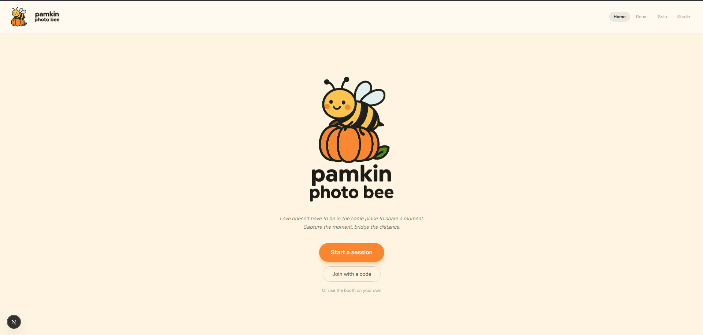

<div align="center">



**A photobooth for two people who aren't in the same room.**

Both cameras stay live in a shared session, **one countdown fires both shutters at the
same instant**, and every frame comes back with both of you in it. Stack a few and you
have a photocard to download.

</div>

---

## Quick start

Requires **Node 20.9+** (Next 16) and [pnpm](https://pnpm.io/installation).

```bash
pnpm install
pnpm dev
```

Open **http://localhost:3000** and allow camera access. The booth works immediately —
no accounts, no database, no configuration.

> Sessions between two *different devices* need Supabase credentials. Without them a
> room falls back to `BroadcastChannel`, which reaches other tabs in the same browser
> and nothing else — the room tells you so in a banner. See
> [Cross-device sessions](#cross-device-sessions).

## Commands

```bash
pnpm dev              # dev server on :3000 (or the next free port)
pnpm build            # production build — includes a full TypeScript pass
pnpm start            # serve the production build
pnpm lint             # eslint
pnpm exec tsc --noEmit  # types only, without a full build
```

## The routes

| Route | What it is |
|---|---|
| `/` | Landing — start a session or join one |
| `/join` | Enter a room code |
| `/room` | The two-person booth before a session exists — set up your camera and card, then create or join |
| `/room/[code]` | **The two-person booth.** Share a code or QR, both cameras go live, one countdown fires both shutters |
| `/solo` | The single-device booth — countdown, captures, retake, 300 DPI PNG |
| `/studio` | Layout and theme harness. Runs on synthetic photos, so you can try every card, theme, border, and filter without a camera |

Rooms hand their finished card to `/studio` in memory — the same canvases, not a copy —
so nothing is re-encoded on the way over and a photo can be flipped individually.

## Cross-device sessions

The booth is fully usable without this. It only governs whether a room can reach a
*second device*.

1. Create a project at [supabase.com](https://supabase.com) (the free tier is plenty —
   this uses **Realtime only**: presence and broadcast, no tables, no auth, no storage).
2. Grab the **Project URL** and the **publishable key**. The **Connect** button at the
   top of the project dashboard shows both together and is the quickest route;
   otherwise **Settings → API Keys**.
3. Put them in `.env.local` at the repo root:

   ```bash
   NEXT_PUBLIC_SUPABASE_URL=https://your-project.supabase.co
   NEXT_PUBLIC_SUPABASE_PUBLISHABLE_KEY=sb_publishable_xxxxxxxxxxxxx
   ```

4. Restart the dev server. `NEXT_PUBLIC_*` values are compiled into the bundle, so a
   running server will not pick them up.

Use the **publishable** key (or a legacy `eyJ…` anon key via
`NEXT_PUBLIC_SUPABASE_ANON_KEY`). Never a `service_role` secret — both variables are
`NEXT_PUBLIC_` and ship to the browser.

Set `NEXT_PUBLIC_USE_LOCAL_TRANSPORT=1` to force the `BroadcastChannel` fallback with
credentials left in place. That path is otherwise unreachable once a project is
configured, and it is the only way to test it.

Full walkthrough, including the deploy loop's two silent-failure traps:
**[docs/setup.md](docs/setup.md)**.

## Built with

Next.js 16.3 (App Router, Turbopack) · React 19.2 · Tailwind CSS v4 · TypeScript.
Photographs never touch a server — they are composited in the browser and stay on the
device that took them.

## Docs

| Document | What's in it |
|---|---|
| [docs/plan.md](docs/plan.md) | What's being built, and the phased path to it |
| [docs/architecture.md](docs/architecture.md) | Realtime transport, shutter sync, frame handoff, session model |
| [docs/setup.md](docs/setup.md) | Running it, Supabase, and deploying |
| [docs/brand.md](docs/brand.md) | Logo assets, the sampled palette, card typography |
| [docs/decisions.md](docs/decisions.md) | Choices with their reasoning |
| [CLAUDE.md](CLAUDE.md) | Conventions and traps for contributors, human or agent |

## Deploying

Push to GitHub and import the repo at [vercel.com/new](https://vercel.com/new). Then:

- Add `NEXT_PUBLIC_SUPABASE_URL` and `NEXT_PUBLIC_SUPABASE_PUBLISHABLE_KEY` under
  **Settings → Environment Variables** for **Production _and_ Preview**. `.env.local` is
  gitignored and never reaches Vercel.
- Do **not** set `NEXT_PUBLIC_USE_LOCAL_TRANSPORT` there — it would pin every deployed
  room to the same-browser fallback.
- Camera access requires HTTPS. Vercel provides it; `localhost` is exempt.

Every push to `main` redeploys production; every other branch gets its own preview URL,
which is the only practical way to test a room across two real phones.

---

<div align="center">
<sub>The name is <b>pamkin</b>, not pumpkin. It comes from the logo.</sub>
</div>
